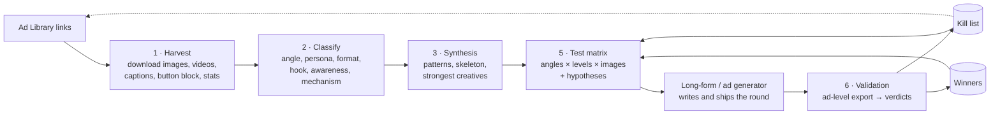
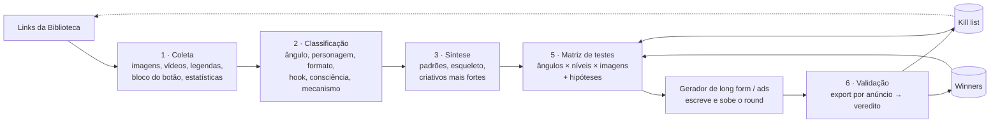

<div align="center">

# FB Ad Library Spy

**Competitor intelligence → test matrix → validated learnings.**
A Claude Code skill that turns Meta Ad Library links into a classified swipe file, converts it into a falsifiable test matrix for your long-form / ad generator, and reads the round's results back into a kill list and a winners registry.


[English](#english) · [Português (BR)](#português-br)

</div>

---

# English

## Table of contents

1. [What it does](#what-it-does)
2. [The loop](#the-loop)
3. [Features](#features)
4. [How it works under the hood](#how-it-works-under-the-hood)
5. [Requirements](#requirements)
6. [Installation](#installation)
7. [Usage](#usage)
8. [Output reference](#output-reference)
9. [Classification taxonomy](#classification-taxonomy)
10. [Synthesis](#synthesis)
11. [Test matrix](#test-matrix)
12. [Round validation, kill list and winners](#round-validation-kill-list-and-winners)
13. [Integrating with a long-form / ad generator](#integrating-with-a-long-form--ad-generator)
14. [CLI reference](#cli-reference)
15. [Limits, throttling and troubleshooting](#limits-throttling-and-troubleshooting)
16. [Legal and ethical use](#legal-and-ethical-use)
17. [Repository layout](#repository-layout)
18. [FAQ](#faq)
19. [License](#license)

## What it does

Paste one or more Meta Ad Library links (a keyword search or a single advertiser's page) and the skill:

1. **Downloads every creative:** images at original resolution, carousel cards, dynamic-creative extra images, and for video ads, the `.mp4`, its preview frame and the hook keyframes.
2. **Saves every piece of text** next to its creative: the primary text (the caption, fully, even at 15,000+ characters), the **headline and description shown next to the button**, the **button itself** (CTA), the display domain and the landing URL.
3. **Collects the stats:** advertiser, likes, category, the advertiser's total active ads, how many of its ads appear in this search, how many ads run *this exact creative*, live-since date and days running, platforms, library rank, caption length and the lines shown before "See more".
4. **Cleans the set:** filters generic links down to images only (or videos only), removes duplicate ad IDs and collapses identical creatives (same image + same caption) into one numbered item with a scale count.
5. **Classifies every creative** by looking at it: angle, angle category, persona, visual format, hook, awareness level, mechanism, offer, caption structure and what to steal. Videos also get first-3-seconds and video format, from keyframes and a local transcript.
6. **Writes a synthesis** of how the competitor operates, which angles and personas dominate, the caption skeleton, button-block patterns, visuals, the strongest creatives to build on, and red flags not to copy.
7. **Builds the next test matrix** (angles × awareness levels × image variations), every cell backed by spy evidence, ready to feed your long-form / ad generator.
8. **Validates the round** from your ad-level export, then updates the **kill list** (what lost) and the **winners registry** (which asset won), so the next matrix starts smarter.

## The loop



The spy answers *what the market is running*. The matrix answers *what we will test*. The validation answers *what we learned*. The kill list and winners make sure nothing is tested twice by accident and what won is scaled **as the asset** (that copy with that image), not rewritten from its label.

## Features

| Area | Capability |
|---|---|
| Collection | Full result sets, not just the first page: SSR payload + intercepted GraphQL pagination until `has_next_page = false` |
| Filtering | `--media image / video / all` rewrites the link's `media_type` (server-side) and filters client-side, so generic links work; automatic fallback when Meta's filter wrongly returns 0 |
| Text | Primary text (untruncated), headline, link description, CTA text + type, display domain, landing URL, carousel cards, DCO text variations |
| Identity | The page shown in the feed **and** the account that pays, so whitelisting through persona, creator and publisher pages is visible |
| Stats | Advertiser totals, ads per creative, ads per profile in the search, live-since, days running, platforms, rank, caption length, pre-"See more" lines |
| De-duplication | Perceptual hashing (dHash) of the image or video preview frame + normalised caption; cross-reference of the same image under different captions |
| Video | MP4 + preview frame, hook frames at 0/1/2/3 s + 4 spread frames (ffmpeg), local timestamped transcription (faster-whisper, free, CPU) |
| Outputs | Numbered media, one Markdown file per creative, `INDEX.md`, `data.csv`, `data.xlsx` (filterable, frozen header), `raw.json`, `meta.json` |
| Analysis | Parallel sub-agents classify every creative with a fixed taxonomy; results merged idempotently into every file |
| Synthesis | Evidence-weighted (duplications, rank, pages, days), every number computed from data and every code verified |
| Test matrix | `test-matrix.md` + `test-matrix.json`, cell ids that survive into ad names, hypotheses, locks, evidence |
| Validation | Verdict per cell and per image variant (winner / killed / keep testing / inconclusive), kill list and winners appended automatically |
| Languages | Labels in English or Portuguese (`--lang en|pt`); the analysis follows the user's language |
| Input | Ad Library URL, a saved Ad Library `.html` file, or `--pages-from` to expand every advertiser of a keyword harvest |

## How it works under the hood

**Where the data lives.** The Ad Library page server-renders its first ~30 results inside a large `<script type="application/json">` blob (the `search_results_connection` of `ad_library_main`). Every further page arrives as a GraphQL response while the page scrolls. `harvest.py` opens the link in headless Chromium (Playwright), parses the blob, then scrolls and intercepts each GraphQL response until Meta reports there is no next page. No login and no API token are needed.

**Filtering generic links.** Before loading, `media_type` in the URL is replaced by the requested media, so Meta itself filters. After collection a second, client-side filter drops anything that doesn't match (e.g., a dynamic creative that mixes video into an "image" search).

**Advertiser totals.** For each advertiser in the result set, the advertiser's own `view_all_page_id` page is loaded to read its total of active ads (with retries, since this is where throttling shows up first).

**De-duplication.** Advertisers run the same creative as many ads, often from several persona pages at once. Meta re-encodes the image for every ad, so byte hashes never match. The script computes a 64-bit difference hash of each image (or of the video's preview frame) and groups ads whose hash and whitespace-normalised caption are identical. The group size is exported as `ads_with_this_creative`, the strongest winner signal the Library exposes publicly. When the same image runs with a different caption, the codes are cross-referenced in `same_image_other_copy`, which exposes the advertiser's testing grid.

**Video.** The MP4 and its preview frame are saved. With ffmpeg on PATH, frames at 0, 1, 2 and 3 seconds (the hook) and at 25/50/75/95 % of the runtime go to `frames/`. With `--transcribe`, faster-whisper transcribes locally with timestamps, and the transcript lands in the creative's `.md` and in `data.csv`.

**Classification.** Claude reads every image (or frames + transcript) and caption through parallel sub-agents, each writing `analysis_partK.json`. `apply_analysis.py` merges them into the `.md` files, `INDEX.md` and the spreadsheets, and it can be re-run safely.

## Requirements

- [Claude Code](https://claude.com/claude-code)
- Python 3.10+
- Python packages: `playwright`, `requests`, `Pillow`, `openpyxl` (and optionally `faster-whisper` for transcription)
- Chromium for Playwright (`python -m playwright install chromium`)
- Optional: `ffmpeg` / `ffprobe` on PATH for video hook frames

## Installation

**Windows:** clone the repo and run `Install.bat`.
**macOS / Linux / Git Bash:** clone the repo and run `./install.sh`.

The installer copies `skills/fb-ad-library-spy/` to `~/.claude/skills/`, installs the Python requirements and Chromium, and warns if ffmpeg is missing. The skill is then available in every Claude Code session, in any folder. Re-run the installer after pulling updates.

## Usage

Talk to Claude Code in plain language, in any project folder:

```text
spy on this: https://www.facebook.com/ads/library/?...&view_all_page_id=123456789012345
```
```text
faz spy nesses 4 links, só imagens, e depois me dá a síntese de cada um e um comparativo
```
```text
same thing for videos on this advertiser, with transcripts
```
```text
build the next test matrix for our product from the Acme and Globex spy
```
```text
here's the Ads Manager export of T102, validate the round and update the kill list
```

Or invoke it explicitly: `/fb-ad-library-spy <links> [Name] [images only | videos only | all] [max N]`.

The skill runs the scripts for you. You can also run them directly (see [CLI reference](#cli-reference)).

### Expanding a keyword search to every advertiser

A keyword search only returns the ads whose text contains the words. Each advertiser's page holds **all** of its active ads (a persona page found with 3 ads in the search often runs 50 to 100). `--pages-from` takes an existing harvest folder and harvests the full page of every advertiser in it, one folder per advertiser, sequentially, marking in `also_in` every creative that was already in the parent harvest:

```bash
python harvest.py --pages-from "spy/Acme Image Ads 23.09.2026" --lang pt --country ALL
```

The country matters: the same page can show 4 image ads for `US` and 8 for `ALL`. Use `ALL` unless you are studying one market.

In the full cycle, everything lives under one **brand umbrella folder**:

```
spy/Acme/                                   brand umbrella
├── Acme Image Ads 23.09.2026/              the original link (search or page)
├── John Doe Image Ads 23.09.2026/          every page that advertises for the brand
├── Men's Health Lab Image Ads 23.09.2026/
└── _operation-23.09.2026.md                operation-level synthesis across all of them
```

```bash
python harvest.py --url "<link>" --root "spy/Acme" --lang en
python harvest.py --pages-from "spy/Acme/Acme Image Ads 23.09.2026"      # expansions land in spy/Acme/
```

## Output reference

Folders are named automatically as **`<Page name> Image Ads DD.MM.YYYY`** (`Video Ads` / `All Ads` depending on `--media`; for keyword links the search term replaces the page name), so re-harvests on other days never overwrite each other. Files inside use a PascalCase prefix.

```
spy/
└── Acme Image Ads 23.09.2026/
    ├── INDEX.md                  overview, profile table, CTA/domain/landing tables, creative table, synthesis
    ├── data.csv / data.xlsx      one row per creative (column dictionary below)
    ├── raw.json                  untouched Ad Library payload of the kept ads
    ├── meta.json                 name, source URL, results reported, collection date, language
    ├── analysis_part1..N.json    classification written by the sub-agents
    ├── synthesis.md              the synthesis (also injected into INDEX.md)
    ├── Acme_001.jpg        creative #1 (library order)
    ├── Acme_001.md         everything about creative #1
    ├── Acme_008_1.jpg …    carousel / multi-image creative
    ├── Acme_012.mp4        video creative
    ├── Acme_012_thumb.jpg  its preview frame
    └── frames/
        └── Acme_012_t000.0.jpg …  hook frames
```

**Anatomy of `<Name>_NNN.md`:** header (profile, files, Ad Library link) → stats table → primary text (quoted, complete) → button block (headline, description, CTA, domain, landing URL) → carousel cards / DCO variations when present → video transcript and frames when present → ads sharing this creative (IDs, pages, dates, headline, CTA, link) → analysis fields.

**`data.csv` columns**

| Column | Meaning |
|---|---|
| `code` | `<Name>_NNN`, numbered in library order (impressions, when the link sorts by impressions) |
| `files` | Media files of this creative |
| `profile`, `profile_url`, `page_id` | The page shown in the feed (a persona, creator or publisher page on partnership / whitelisted ads) |
| `advertiser` | The account that pays, when it differs from the page shown (whitelisting) |
| `partnership` | `yes` for branded-content / partnership ads |
| `profile_likes`, `profile_category` | Page likes and category |
| `profile_active_ads` | Advertiser's total active ads, all formats |
| `profile_ads_in_search` | Advertiser's ads inside this result set |
| `profile_creatives_in_search` | Advertiser's distinct creatives inside this result set |
| `ads_with_this_creative` | Ads running this exact creative (scale signal) |
| `same_image_other_copy` | Codes that use the same image with a different caption |
| `also_in` | With `--pages-from`: the parent-harvest code(s) that already contained this creative |
| `format` | IMAGE / VIDEO / DCO / carousel (with card count) |
| `live_since`, `days_running` | Earliest start date among the grouped ads, and max days live |
| `platforms` | Facebook, Instagram, Messenger, Audience Network, Threads |
| `button_headline`, `button_description`, `cta` | The block next to the button |
| `display_domain`, `landing_url` | Where the ad sends traffic |
| `caption_chars`, `before_see_more` | Caption length, first three lines |
| `caption`, `transcript` | Full primary text, video transcript |
| `angle` … `steal`, `hook_3s`, `video_format` | Classification (see below) |
| `ad_ids`, `library_url` | Every grouped ad ID, link to the first one |

## Classification taxonomy

| Field | Content |
|---|---|
| `angle` | The specific angle, as a reusable label |
| `angle_category` | One value from a fixed list, adapted to the niche once and kept identical across batches and folders |
| `persona` | Who speaks / is shown; persona pages vs the brand page are flagged |
| `visual_format` | What the image or video is, including overlay text |
| `hook` | Visual hook + first line |
| `awareness` | Unaware, Problem aware, Solution aware, Product aware, Most aware |
| `mechanism` | Named cause / mechanism, or None |
| `offer` | Promise and offer mechanics (dose, guarantee, discount, quiz, bundle) |
| `structure` | Caption blocks in order (`hook > pain > false causes > mechanism > …`) |
| `steal` | The single most reusable element |
| `hook_3s` *(video)* | What happens in the first three seconds, seen and said |
| `video_format` *(video)* | UGC talking head, podcast clip, doctor explainer, skit… and pacing |

The default category list (health / supplements / DTC) ships in `references/analysis-schema.md`, with Portuguese equivalents.

## Synthesis

Every number is computed from `data.csv` and weighted by `ads_with_this_creative`. Signals are ranked by strength: **duplication** (the same creative multiplied across ads and pages) > **library rank** > **days running** (weak when the advertiser rotates creatives every few days) > **testing grid** (image tests, caption tests, destination tests quiz vs product page). Sections: operation set-up, angles and personas, caption skeleton, button block, visuals, strongest creatives (with evidence), red flags. When several links are processed together, a cross-competitor comparison is written too.

## Test matrix

Step 5 turns the synthesis into `test-matrix.md` + `test-matrix.json`: **N angles × M awareness levels × K image variations** (default 5 × 3 × 3 = 15 copies, 45 images).

- Every angle is backed by spy evidence (codes + signal), or explicitly marked as a **gap bet** (nobody runs it, here's why that may be an opportunity).
- Awareness columns are **structural**: A opens on a lived scene, B on what already failed, C on the mechanism as news. If the first three lines of A, B and C of one angle could be swapped, the matrix isn't ready.
- One copy per cell. The K images are the only variable inside a cell (e.g., ethnicity or setting), fixed for the whole round.
- Each cell carries `id` (e.g., `B3-A`, images `B3-A1..3`), angle, level, anchor hook, persona and page, mechanism position, evidence, what changes vs the competitor, locks (forbidden claims, killed hooks), character target, hypothesis and status.
- The kill list is read first: killed angles never come back without a new stated reason. Winners return as assets.
- Cell ids **must appear in the ad names** in Ads Manager (`MK ACME T102-B3-A2`). That is what makes automatic validation possible.

## Round validation, kill list and winners

`validate_round.py` reads the matrix and the ad-level export (Meta Ads Manager CSV/XLSX in English or Portuguese, `,`/`;`/tab separators, `1,234.56` or `1.234,56` numbers, and any other tool with an ad-name + spend + conversions column), matches each ad to its cell and image variant by name, and applies:

| Verdict | Rule |
|---|---|
| `inconclusive` | spend < spend floor: not enough money to read |
| `winner` | conversions ≥ minimum **and** CPA ≤ target |
| `killed` | spend ≥ floor **and** (0 conversions **or** CPA > kill-multiple × target, default 2×) |
| `keep_testing` | everything in between |

It writes `round-results.md` (cell and image-variant tables with spend, conversions, CPA, ROAS, CTR and verdict, then the decisions: scale / kill / keep testing / below floor, plus unmatched ads with spend), updates every cell's `status` in the matrix, appends killed cells to `kill-list.md` and appends winning **assets** (copy file + best image variant) to `winners.md`.

## Integrating with a long-form / ad generator

The skill is generator-agnostic, but it was built to feed a long-form static ad builder (image hook + 2,500 to 15,000-character primary text):

- If a generator skill is installed (e.g., `longform-builder`), its matrix rules win. This skill's matrix is the **proposal** the generator's matrix phase starts from, and the round is written by invoking the generator itself, never by bypassing its quality gates.
- `validate_round.py` also accepts the generator's own `tracking/batches.json` (Portuguese keys `angulo`, `nivel`, `imagens` are understood).
- The kill list and winners files are plain Markdown tables, easy to point any generator at.

## CLI reference

### `harvest.py`

| Flag | Default | Description |
|---|---|---|
| `--url URL` / `--html FILE` / `--pages-from DIR` | required, one of them | Ad Library link; a saved Ad Library page (first ~30 ads only); or an existing harvest whose advertisers are all expanded |
| `--country CC` | `ALL` | Country used by `--pages-from` |
| `--delay S` | `20` | Pause between advertisers with `--pages-from` |
| `--name NAME` | derived | File/folder prefix; derived from the advertiser (page links) or the search term (keyword links) |
| `--root DIR` | `$AD_SPY_ROOT` or `./spy` | Parent of the automatic `<Page name> Image Ads DD.MM.YYYY` folder |
| `--out DIR` | automatic | Exact output folder (overrides `--root` and the automatic name) |
| `--media image\|video\|all` | `image` | Media to keep; rewrites the link and filters client-side |
| `--max N` | `500` | Maximum ads to collect |
| `--lang en\|pt` | `en` | Language of the Markdown labels |
| `--transcribe` | off | Transcribe videos with faster-whisper |
| `--whisper-model SIZE` | `small` | `tiny`, `base`, `small`, `medium`, `large-v3` |
| `--no-frames` | off | Skip ffmpeg hook frames |
| `--no-dedupe` | off | Keep identical creatives separate |
| `--no-profile-totals` | off | Skip the advertisers' total-active-ads lookup (faster) |
| `--headed` | off | Show the browser |

### `apply_analysis.py`

`--dir FOLDER`: merges every `analysis*.json` and `synthesis.md` into the folder's `.md` files, `INDEX.md`, `data.csv` and `data.xlsx`. Idempotent.

### `validate_round.py`

| Flag | Default | Description |
|---|---|---|
| `--matrix FILE` | required | `test-matrix.json` or a generator's `batches.json` |
| `--results FILE` | required | Ad-level export (CSV/XLSX) |
| `--target-cpa X` | required | CPA that makes a cell a winner |
| `--min-spend X` | required | Spend floor below which nothing is read |
| `--min-conversions N` | `3` | Minimum conversions for a winner |
| `--kill-multiple X` | `2.0` | Kill when CPA > X × target |
| `--kill-list FILE` / `--winners FILE` | next to the matrix | Registries to append to |
| `--out DIR` | next to the matrix | Where `round-results.md` goes |
| `--dry-run` | off | Only write `round-results.md` |
| `--col-name/--col-spend/--col-conversions/--col-revenue/--col-impressions/--col-clicks` | auto | Column headers when auto-detection fails |

## Limits, throttling and troubleshooting

- **Throttling.** Too many Library loads in a short time get a lightweight page with no ad data. The harvester retries once after 45 s and then stops cleanly with a message. Wait 30 to 90 minutes. Always run several links sequentially, never in parallel.
- **Meta's media filter returning 0.** On some advertiser pages (`view_all_page_id`) `media_type=image` returns 0 results even though the advertiser runs image ads. The harvester tells a real empty result apart from throttling, and when the server-side filter comes back empty it automatically re-collects with `media_type=all` and filters locally.
- **Signed CDN URLs** in `raw.json` expire after ~24-48 h. The files are already on disk.
- **Captions cut mid-sentence** are cut in the ad itself. Captions of 15,000+ characters come through whole.
- **Keyword links match unrelated advertisers** (the word appears in their transcript or copy). The classification flags them and the synthesis excludes them.
- Full table: `skills/fb-ad-library-spy/references/troubleshooting.md`.

## Legal and ethical use

The Meta Ad Library is a public transparency tool. This project reads only what the Library shows to any logged-out visitor, at human-like pace, and stores it locally for competitive research. You are responsible for complying with Meta's Terms of Service and the laws that apply to you. **Collected creatives and copy belong to their owners:** use them to study structure and mechanics, never republish them, and never copy claims you can't substantiate. The skill flags compliance risks it sees (health claims, fake credentials, lookalikes, sensitive targeting) precisely so they are not reproduced.

## Repository layout

```
fb-ad-library-spy/
├── README.md                       this file (EN + PT-BR)
├── LICENSE / LICENSE.md            CC BY-NC-ND 4.0
├── CLAUDE.md                       notes for maintaining the source repo
├── Install.bat / install.sh        installers
├── requirements.txt
└── skills/fb-ad-library-spy/
    ├── SKILL.md                    the skill: steps 0-6 and hard rules
    ├── scripts/
    │   ├── harvest.py              collection, download, de-duplication, tables
    │   ├── apply_analysis.py       merges classification + synthesis
    │   └── validate_round.py       verdicts, kill list, winners
    └── references/
        ├── analysis-schema.md      fields + category list
        ├── synthesis-guide.md      signals and sections
        ├── matrix-guide.md         test-matrix design + JSON schema
        └── troubleshooting.md
```

## FAQ

**Does it need a Facebook login or an API token?** No. It reads the public Library like a logged-out visitor.

**Why images only by default?** Long-form static testing is image-first, and most pasted links are generic (`media_type=all`). Ask for videos (or `--media video`) and you get MP4s, hook frames and transcripts.

**Why are 88 ads only 70 creatives?** Identical creatives running as several ads are grouped. The count lives in `ads_with_this_creative`, and it is your best winner signal.

**Can I use it for any niche?** Yes. Adapt the category list once per niche (`references/analysis-schema.md`) and keep it fixed across batches.

**Does validation need Meta exports specifically?** No. Any CSV/XLSX with an ad-name column that contains the cell id, plus spend and conversions, works.

## License

**CC BY-NC-ND 4.0**, the most restrictive Creative Commons license: you may share it with attribution; no commercial use; no distribution of modified versions. See [LICENSE](LICENSE). © 2026 Mikael Lovrin.

---

# Português (BR)

## Sumário

1. [O que faz](#o-que-faz)
2. [O ciclo](#o-ciclo)
3. [Funcionalidades](#funcionalidades)
4. [Como funciona por dentro](#como-funciona-por-dentro)
5. [Requisitos](#requisitos)
6. [Instalação](#instalação)
7. [Como usar](#como-usar)
8. [Referência da saída](#referência-da-saída)
9. [Taxonomia de classificação](#taxonomia-de-classificação)
10. [Síntese](#síntese)
11. [Matriz de testes](#matriz-de-testes)
12. [Validação do round, kill list e winners](#validação-do-round-kill-list-e-winners)
13. [Integração com um gerador de long form / ads](#integração-com-um-gerador-de-long-form--ads)
14. [Referência de linha de comando](#referência-de-linha-de-comando)
15. [Limites, bloqueio e solução de problemas](#limites-bloqueio-e-solução-de-problemas)
16. [Uso legal e ético](#uso-legal-e-ético)
17. [Estrutura do repositório](#estrutura-do-repositório)
18. [Perguntas frequentes](#perguntas-frequentes)
19. [Licença](#licença)

## O que faz

Cole um ou mais links da Biblioteca de Anúncios da Meta (uma busca por palavra-chave ou a página de um anunciante) e a skill:

1. **Baixa todos os criativos:** imagens em resolução original, cards de carrossel, imagens extras de criativo dinâmico. Nos anúncios de vídeo, baixa o `.mp4`, o frame de capa e os frames do hook.
2. **Salva todo o texto** ao lado de cada criativo: a legenda completa (mesmo com mais de 15.000 caracteres), a **headline e a descrição ao lado do botão**, o **próprio botão** (CTA), o domínio exibido e o link de destino.
3. **Coleta as estatísticas:** anunciante, curtidas, categoria, total de anúncios ativos do anunciante, quantos anúncios dele aparecem nesta busca, quantos anúncios rodam *exatamente este criativo*, data de início e dias no ar, plataformas, posição na biblioteca, tamanho da legenda e as linhas que aparecem antes do "ver mais".
4. **Faz a limpeza:** filtra links genéricos para só imagens (ou só vídeos), remove IDs duplicados e junta criativos idênticos (mesma imagem e mesma legenda) num item numerado, com a contagem de escala.
5. **Classifica cada criativo** olhando para ele: ângulo, categoria do ângulo, personagem, formato visual, hook, nível de consciência, mecanismo, oferta, estrutura da legenda e o que roubar. Vídeos ganham também primeiros 3 segundos e formato do vídeo, a partir dos frames e de uma transcrição local.
6. **Escreve a síntese:** como o concorrente opera, quais ângulos e personagens dominam, o esqueleto da legenda, os padrões do bloco do botão, o visual, os criativos mais fortes para usar de base e os alertas do que não copiar.
7. **Monta a próxima matriz de testes** (ângulos × níveis de consciência × variações de imagem), cada célula apoiada em evidência do spy e pronta para alimentar o seu gerador de long form / ads.
8. **Valida o round** a partir do export por anúncio e atualiza a **kill list** (o que perdeu) e o **registro de winners** (qual ativo ganhou), para a próxima matriz já nascer mais inteligente.

## O ciclo



O spy responde *o que o mercado está rodando*, a matriz responde *o que vamos testar* e a validação responde *o que aprendemos*. A kill list e os winners garantem que nada seja testado duas vezes por acidente e que o que ganhou escale **como ativo** (aquela copy com aquela imagem), e não reescrito a partir do rótulo do ângulo.

## Funcionalidades

| Área | O que faz |
|---|---|
| Coleta | Resultado completo, não só a primeira página: conteúdo do HTML inicial + paginação GraphQL interceptada até `has_next_page = false` |
| Filtro | `--media image / video / all` reescreve o `media_type` do link (filtro no servidor) e filtra de novo localmente, então link genérico funciona; fallback automático quando o filtro da Meta devolve 0 por engano |
| Texto | Legenda (sem corte), headline, descrição do link, texto e tipo do CTA, domínio exibido, link de destino, cards de carrossel, variações de texto DCO |
| Identidade | A página exibida no feed **e** a conta que paga, deixando visível o whitelisting por páginas-persona, criadores e publishers |
| Estatísticas | Total do anunciante, ads por criativo, ads por perfil na busca, data de início, dias no ar, plataformas, posição, tamanho da legenda, linhas antes do "ver mais" |
| Deduplicação | Hash perceptual (dHash) da imagem ou do frame de capa do vídeo + legenda normalizada; referência cruzada da mesma imagem com legendas diferentes |
| Vídeo | MP4 + capa, frames do hook em 0/1/2/3 s + 4 frames distribuídos (ffmpeg), transcrição local com timestamps (faster-whisper, grátis, CPU) |
| Saídas | Mídia numerada, um Markdown por criativo, `INDEX.md`, `data.csv`, `data.xlsx` (com filtro e cabeçalho congelado), `raw.json`, `meta.json` |
| Análise | Subagentes em paralelo classificam cada criativo numa taxonomia fixa; a aplicação nos arquivos pode ser repetida sem estragar nada |
| Síntese | Ponderada por evidência (duplicação, posição, perfis, dias), todo número calculado dos dados e todo código conferido |
| Matriz | `test-matrix.md` + `test-matrix.json`, IDs de célula que vão para o nome do anúncio, hipóteses, travas, evidência |
| Validação | Veredito por célula e por variação de imagem (winner / morto / seguir testando / inconclusivo), kill list e winners atualizados automaticamente |
| Idiomas | Rótulos em inglês ou português (`--lang en\|pt`); a análise segue o idioma do usuário |
| Entrada | Link da Biblioteca, um `.html` salvo da Biblioteca, ou `--pages-from` para expandir cada anunciante de uma busca por palavra-chave |

## Como funciona por dentro

**Onde os dados estão.** A página da Biblioteca já vem com os ~30 primeiros resultados dentro de um grande bloco `<script type="application/json">` (o `search_results_connection` do `ad_library_main`). As páginas seguintes chegam como respostas GraphQL conforme a página rola. O `harvest.py` abre o link num Chromium headless (Playwright), lê esse bloco e depois rola a página interceptando cada resposta GraphQL até a Meta informar que não há próxima página. Não precisa de login nem de token de API.

**Filtro de links genéricos.** Antes de carregar, o `media_type` do link é trocado pela mídia pedida, e a própria Meta filtra. Depois da coleta, um segundo filtro local descarta o que não bate (por exemplo, criativo dinâmico que mistura vídeo numa busca de imagem).

**Total do anunciante.** Para cada anunciante do resultado, a página `view_all_page_id` dele é carregada para ler o total de anúncios ativos, com novas tentativas, porque é aí que o bloqueio aparece primeiro.

**Deduplicação.** Anunciantes rodam o mesmo criativo em vários anúncios, muitas vezes por várias páginas-persona ao mesmo tempo. A Meta recomprime a imagem em cada anúncio, então o hash dos bytes nunca bate. O script calcula um hash de diferença de 64 bits de cada imagem (ou do frame de capa do vídeo) e agrupa os anúncios com o mesmo hash e a mesma legenda normalizada. O tamanho do grupo vira `ads_with_this_creative`, o sinal de vencedor mais forte que a Biblioteca expõe publicamente. Quando a mesma imagem roda com outra legenda, os códigos se cruzam em `same_image_other_copy`, o que revela a grade de testes do anunciante.

**Vídeo.** O MP4 e a capa são salvos. Com ffmpeg no PATH, frames em 0, 1, 2 e 3 segundos (o hook) e em 25/50/75/95% da duração vão para `frames/`. Com `--transcribe`, o faster-whisper transcreve localmente com timestamps, e a transcrição vai para o `.md` do criativo e para o `data.csv`.

**Classificação.** O Claude lê cada imagem (ou frames + transcrição) e cada legenda através de subagentes em paralelo, e cada um grava um `analysis_partK.json`. O `apply_analysis.py` junta tudo nos `.md`, no `INDEX.md` e nas planilhas, e pode ser rodado de novo sem problema.

## Requisitos

- [Claude Code](https://claude.com/claude-code)
- Python 3.10+
- Pacotes Python: `playwright`, `requests`, `Pillow`, `openpyxl` (e, opcionalmente, `faster-whisper` para transcrição)
- Chromium do Playwright (`python -m playwright install chromium`)
- Opcional: `ffmpeg` / `ffprobe` no PATH para os frames do hook dos vídeos

## Instalação

**Windows:** clone o repositório e rode `Install.bat`.
**macOS / Linux / Git Bash:** clone o repositório e rode `./install.sh`.

O instalador copia `skills/fb-ad-library-spy/` para `~/.claude/skills/`, instala os requisitos Python e o Chromium, e avisa se faltar ffmpeg. A partir daí a skill fica disponível em qualquer sessão do Claude Code, em qualquer pasta. Rode o instalador de novo depois de atualizar o repositório.

## Como usar

Fale com o Claude Code em linguagem natural, em qualquer pasta de projeto:

```text
faz spy nesse link: https://www.facebook.com/ads/library/?...&view_all_page_id=123456789012345
```
```text
faz spy nesses 4 links, só imagens, e depois me dá a síntese de cada um e um comparativo
```
```text
agora os vídeos desse anunciante, com transcrição
```
```text
monta a próxima matriz de testes do nosso produto a partir do spy da Acme e da Globex
```
```text
aqui está o export do Gerenciador do T102, valida o round e atualiza a kill list
```

Ou chame explicitamente: `/fb-ad-library-spy <links> [Nome] [só imagens | só vídeos | tudo] [máx N]`.

A skill roda os scripts por você. Eles também podem ser rodados direto (ver [Referência de linha de comando](#referência-de-linha-de-comando)).

### Expandir uma busca por palavra-chave para cada anunciante

A busca por palavra-chave só traz os anúncios cujo texto contém as palavras. A página de cada anunciante tem **todos** os anúncios ativos dela (uma página-persona que aparece com 3 anúncios na busca costuma rodar 50 a 100). O `--pages-from` pega uma pasta já coletada e coleta a página completa de cada anunciante dela, uma pasta por anunciante, em sequência, marcando em `also_in` cada criativo que já estava na coleta de origem:

```bash
python harvest.py --pages-from "spy/Acme Image Ads 23.09.2026" --lang pt --country ALL
```

O país importa: a mesma página pode mostrar 4 anúncios de imagem com `US` e 8 com `ALL`. Use `ALL`, a não ser que o estudo seja de um mercado específico.

No ciclo completo, tudo fica numa **pasta-guarda-chuva da marca**:

```
spy/Acme/                                   guarda-chuva da marca
├── Acme Image Ads 23.09.2026/              o link original (busca ou página)
├── John Doe Image Ads 23.09.2026/          cada página que anuncia para a marca
├── Men's Health Lab Image Ads 23.09.2026/
└── _operacao-23.09.2026.md                 síntese da operação inteira
```

```bash
python harvest.py --url "<link>" --root "spy/Acme" --lang pt
python harvest.py --pages-from "spy/Acme/Acme Image Ads 23.09.2026"      # as expansões caem em spy/Acme/
```

## Referência da saída

As pastas são nomeadas automaticamente como **`<Nome da página> Image Ads DD.MM.AAAA`** (`Video Ads` / `All Ads` conforme o `--media`; em links de palavra-chave, o termo buscado entra no lugar do nome da página), então coletas em dias diferentes nunca se sobrescrevem. Os arquivos dentro usam prefixo em PascalCase.

```
spy/
└── Acme Image Ads 23.09.2026/
    ├── INDEX.md                  visão geral, perfis, CTAs/domínios/destinos, tabela de criativos, síntese
    ├── data.csv / data.xlsx      uma linha por criativo (dicionário de colunas abaixo)
    ├── raw.json                  resposta original da Biblioteca dos anúncios mantidos
    ├── meta.json                 nome, link de origem, resultados informados, data da coleta, idioma
    ├── analysis_part1..N.json    classificação gravada pelos subagentes
    ├── synthesis.md              a síntese (também injetada no INDEX.md)
    ├── Acme_001.jpg        criativo nº 1 (ordem da biblioteca)
    ├── Acme_001.md         tudo sobre o criativo nº 1
    ├── Acme_008_1.jpg …    carrossel / criativo com várias imagens
    ├── Acme_012.mp4        criativo em vídeo
    ├── Acme_012_thumb.jpg  a capa do vídeo
    └── frames/
        └── Acme_012_t000.0.jpg …  frames do hook
```

**Anatomia do `<Nome>_NNN.md`:** cabeçalho (perfil, arquivos, link da Biblioteca) → tabela de estatísticas → legenda (citada, completa) → bloco do botão (headline, descrição, CTA, domínio, destino) → cards de carrossel / variações DCO, quando houver → transcrição e frames do vídeo, quando houver → anúncios que compartilham este criativo (IDs, páginas, datas, headline, CTA, link) → campos de análise.

**Colunas do `data.csv`**

| Coluna | Significado |
|---|---|
| `code` | `<Nome>_NNN`, numerado na ordem da biblioteca (impressões, quando o link ordena por impressões) |
| `files` | Arquivos de mídia do criativo |
| `profile`, `profile_url`, `page_id` | A página que aparece no feed (página-persona, criador ou publisher nos anúncios de parceria / whitelisting) |
| `advertiser` | A conta que paga, quando é diferente da página exibida (whitelisting) |
| `partnership` | `yes` para anúncios de parceria / branded content |
| `profile_likes`, `profile_category` | Curtidas e categoria da página |
| `profile_active_ads` | Total de anúncios ativos do anunciante, todos os formatos |
| `profile_ads_in_search` | Anúncios do anunciante dentro deste resultado |
| `profile_creatives_in_search` | Criativos distintos do anunciante dentro deste resultado |
| `ads_with_this_creative` | Anúncios rodando exatamente este criativo (sinal de escala) |
| `same_image_other_copy` | Códigos que usam a mesma imagem com outra legenda |
| `also_in` | Com `--pages-from`: o(s) código(s) da coleta de origem que já tinham este criativo |
| `format` | IMAGE / VIDEO / DCO / carrossel (com número de cards) |
| `live_since`, `days_running` | Data de início mais antiga entre os anúncios agrupados e o máximo de dias no ar |
| `platforms` | Facebook, Instagram, Messenger, Audience Network, Threads |
| `button_headline`, `button_description`, `cta` | O bloco ao lado do botão |
| `display_domain`, `landing_url` | Para onde o anúncio manda o tráfego |
| `caption_chars`, `before_see_more` | Tamanho da legenda e as três primeiras linhas |
| `caption`, `transcript` | Legenda completa e transcrição do vídeo |
| `angle` … `steal`, `hook_3s`, `video_format` | Classificação (ver abaixo) |
| `ad_ids`, `library_url` | Todos os IDs agrupados e link para o primeiro |

## Taxonomia de classificação

| Campo | Conteúdo |
|---|---|
| `angle` | O ângulo específico, como um rótulo reutilizável |
| `angle_category` | Um valor de uma lista fixa, adaptada ao nicho uma vez e mantida igual entre lotes e pastas |
| `persona` | Quem fala ou aparece; página-persona vs página da marca é sinalizado |
| `visual_format` | O que é a imagem ou o vídeo, incluindo texto sobreposto |
| `hook` | Hook visual + primeira linha |
| `awareness` | Unaware, Problem aware, Solution aware, Product aware, Most aware |
| `mechanism` | Causa / mecanismo nomeado, ou Nenhum |
| `offer` | Promessa e mecânica da oferta (dose, garantia, desconto, quiz, kit) |
| `structure` | Blocos da legenda em ordem (`hook > dor > falsas causas > mecanismo > …`) |
| `steal` | O elemento mais reaproveitável |
| `hook_3s` *(vídeo)* | O que acontece nos três primeiros segundos, visto e falado |
| `video_format` *(vídeo)* | UGC falando para a câmera, corte de podcast, médico explicando, esquete… e ritmo |

A lista de categorias padrão (saúde / suplementos / DTC) está em `references/analysis-schema.md`, com os equivalentes em português.

## Síntese

Todo número é calculado a partir do `data.csv` e ponderado por `ads_with_this_creative`. Os sinais vão do mais forte ao mais fraco: **duplicação** (o mesmo criativo multiplicado em anúncios e páginas) > **posição na biblioteca** > **dias no ar** (fraco quando o anunciante troca criativo a cada poucos dias) > **grade de testes** (teste de imagem, de legenda e de destino quiz vs página de produto). Seções: como a operação está montada, ângulos e personagens, esqueleto da legenda, bloco do botão, visual, criativos mais fortes (com evidência) e alertas. Quando vários links são processados juntos, sai também um comparativo entre concorrentes.

## Matriz de testes

O passo 5 transforma a síntese em `test-matrix.md` + `test-matrix.json`: **N ângulos × M níveis de consciência × K variações de imagem** (padrão 5 × 3 × 3 = 15 copies e 45 imagens).

- Todo ângulo tem evidência no spy (códigos + sinal) ou é marcado como **aposta de lacuna** (ninguém roda, e por que isso pode ser oportunidade).
- As colunas de consciência são **estruturais**: A abre numa cena vivida, B no que já falhou, C no mecanismo como notícia. Se as três primeiras linhas de A, B e C de um mesmo ângulo puderem ser trocadas entre si, a matriz não está pronta.
- Uma copy por célula. As K imagens são a única variável dentro da célula (por exemplo, etnia ou cenário), fixa no round inteiro.
- Cada célula tem `id` (ex. `B3-A`, imagens `B3-A1..3`), ângulo, nível, hook âncora, personagem e página, posição do mecanismo, evidência, o que muda em relação ao concorrente, travas (claims proibidos, hooks mortos), faixa de caracteres, hipótese e status.
- A kill list é lida primeiro: ângulo morto não volta sem um motivo novo declarado. Winners voltam como ativos.
- Os IDs das células **precisam estar no nome dos anúncios** no Gerenciador (`MK ACME T102-B3-A2`). É isso que torna a validação automática.

## Validação do round, kill list e winners

O `validate_round.py` lê a matriz e o export por anúncio. Aceita CSV/XLSX do Gerenciador de Anúncios em inglês ou português, separado por `,`, `;` ou tab, com números em `1,234.56` ou `1.234,56`, e também qualquer outra ferramenta que tenha coluna de nome do anúncio, investimento e conversões. Ele casa cada anúncio com sua célula e variação de imagem pelo nome e aplica:

| Veredito | Regra |
|---|---|
| `inconclusive` | investimento < piso: dinheiro insuficiente para ler |
| `winner` | conversões ≥ mínimo **e** CPA ≤ alvo |
| `killed` | investimento ≥ piso **e** (0 conversões **ou** CPA > múltiplo × alvo, padrão 2×) |
| `keep_testing` | tudo o que fica no meio |

Ele grava o `round-results.md`: tabelas por célula e por variação de imagem com investimento, conversões, CPA, ROAS, CTR e veredito, depois as decisões (escalar / matar / seguir testando / abaixo do piso) e os anúncios com gasto que não casaram com nenhuma célula. Também atualiza o `status` de cada célula na matriz, acrescenta as células mortas na `kill-list.md` e acrescenta os **ativos** vencedores (arquivo da copy + melhor variação de imagem) no `winners.md`.

## Integração com um gerador de long form / ads

A skill não depende de um gerador específico, mas foi feita para alimentar um construtor de long form static (imagem como hook + texto principal de 2.500 a 15.000 caracteres):

- Se houver uma skill geradora instalada (por exemplo, `longform-builder`), as regras de matriz dela prevalecem. A matriz desta skill é a **proposta** de onde a fase de matriz do gerador parte, e o round é escrito chamando o próprio gerador, nunca pulando os gates de qualidade dele.
- O `validate_round.py` também aceita o `tracking/batches.json` do próprio gerador (entende as chaves em português `angulo`, `nivel`, `imagens`).
- Kill list e winners são tabelas em Markdown simples, fáceis de apontar para qualquer gerador.

## Referência de linha de comando

### `harvest.py`

| Flag | Padrão | Descrição |
|---|---|---|
| `--url URL` / `--html ARQ` / `--pages-from PASTA` | obrigatório, um dos três | Link da Biblioteca; página salva da Biblioteca (só os ~30 primeiros anúncios); ou uma coleta existente cujos anunciantes são todos expandidos |
| `--country CC` | `ALL` | País usado pelo `--pages-from` |
| `--delay S` | `20` | Pausa entre anunciantes no `--pages-from` |
| `--name NOME` | derivado | Prefixo dos arquivos e da pasta; derivado do anunciante (link de página) ou do termo buscado (link de palavra-chave) |
| `--root PASTA` | `$AD_SPY_ROOT` ou `./spy` | Pasta-mãe da pasta automática `<Nome da página> Image Ads DD.MM.AAAA` |
| `--out PASTA` | automática | Pasta exata de saída (substitui `--root` e o nome automático) |
| `--media image\|video\|all` | `image` | Mídia a manter; reescreve o link e filtra localmente |
| `--max N` | `500` | Máximo de anúncios coletados |
| `--lang en\|pt` | `en` | Idioma dos rótulos no Markdown |
| `--transcribe` | desligado | Transcreve vídeos com faster-whisper |
| `--whisper-model TAM` | `small` | `tiny`, `base`, `small`, `medium`, `large-v3` |
| `--no-frames` | desligado | Não extrai os frames do hook |
| `--no-dedupe` | desligado | Mantém criativos idênticos separados |
| `--no-profile-totals` | desligado | Pula a consulta do total de anúncios de cada anunciante (mais rápido) |
| `--headed` | desligado | Mostra o navegador |

### `apply_analysis.py`

`--dir PASTA`: junta todos os `analysis*.json` e o `synthesis.md` nos `.md`, no `INDEX.md`, no `data.csv` e no `data.xlsx` da pasta. Pode rodar quantas vezes quiser.

### `validate_round.py`

| Flag | Padrão | Descrição |
|---|---|---|
| `--matrix ARQ` | obrigatório | `test-matrix.json` ou o `batches.json` de um gerador |
| `--results ARQ` | obrigatório | Export por anúncio (CSV/XLSX) |
| `--target-cpa X` | obrigatório | CPA que torna a célula vencedora |
| `--min-spend X` | obrigatório | Piso de investimento abaixo do qual nada é lido |
| `--min-conversions N` | `3` | Conversões mínimas para vencedor |
| `--kill-multiple X` | `2.0` | Mata quando o CPA passa de X × alvo |
| `--kill-list ARQ` / `--winners ARQ` | ao lado da matriz | Registros onde acrescentar |
| `--out PASTA` | ao lado da matriz | Onde vai o `round-results.md` |
| `--dry-run` | desligado | Só grava o `round-results.md` |
| `--col-name/--col-spend/--col-conversions/--col-revenue/--col-impressions/--col-clicks` | automático | Cabeçalhos das colunas, se a detecção automática falhar |

## Limites, bloqueio e solução de problemas

- **Bloqueio.** Muitos carregamentos da Biblioteca em pouco tempo fazem a Meta servir uma página leve, sem dados de anúncio. O coletor tenta de novo uma vez depois de 45 s e então para com uma mensagem clara. Espere de 30 a 90 minutos e rode sempre os links em sequência, nunca em paralelo.
- **Filtro de mídia da Meta devolvendo 0.** Em algumas páginas de anunciante (`view_all_page_id`), `media_type=image` devolve 0 resultados mesmo com o anunciante rodando anúncios de imagem. O coletor diferencia resultado vazio de verdade de bloqueio e, quando o filtro do servidor vem vazio, refaz a coleta automaticamente com `media_type=all` e filtra localmente.
- **Os links assinados da CDN** no `raw.json` expiram em ~24-48 h. Os arquivos já estão no disco.
- **Legenda cortada no meio da frase** está cortada no próprio anúncio. Legendas com mais de 15.000 caracteres chegam inteiras.
- **Links de palavra-chave trazem anunciantes sem relação** (a palavra aparece na transcrição ou na copy deles). A classificação sinaliza e a síntese exclui.
- Tabela completa: `skills/fb-ad-library-spy/references/troubleshooting.md`.

## Uso legal e ético

A Biblioteca de Anúncios da Meta é uma ferramenta pública de transparência. Este projeto lê só o que a Biblioteca mostra a qualquer visitante deslogado, em ritmo humano, e guarda localmente para pesquisa de concorrência. Você é responsável por cumprir os Termos de Serviço da Meta e as leis que se aplicam a você. **Os criativos e as copies coletados pertencem aos donos deles:** use para estudar estrutura e mecânica, nunca republique e nunca copie promessas que você não pode comprovar. A skill sinaliza os riscos de compliance que encontra (promessas de saúde, credenciais falsas, sósias, segmentação sensível) justamente para que não sejam reproduzidos.

## Estrutura do repositório

```
fb-ad-library-spy/
├── README.md                       este arquivo (EN + PT-BR)
├── LICENSE / LICENSE.md            CC BY-NC-ND 4.0
├── CLAUDE.md                       notas para manter o repositório-fonte
├── Install.bat / install.sh        instaladores
├── requirements.txt
└── skills/fb-ad-library-spy/
    ├── SKILL.md                    a skill: passos 0 a 6 e regras fixas
    ├── scripts/
    │   ├── harvest.py              coleta, download, deduplicação, tabelas
    │   ├── apply_analysis.py       junta classificação + síntese
    │   └── validate_round.py       vereditos, kill list, winners
    └── references/
        ├── analysis-schema.md      campos + lista de categorias
        ├── synthesis-guide.md      sinais e seções
        ├── matrix-guide.md         desenho da matriz + schema JSON
        └── troubleshooting.md
```

## Perguntas frequentes

**Precisa de login no Facebook ou token de API?** Não. Ela lê a Biblioteca pública como um visitante deslogado.

**Por que só imagens por padrão?** Teste de long form static começa pela imagem, e a maioria dos links colados é genérica (`media_type=all`). Peça vídeos (ou use `--media video`) e você recebe os MP4, os frames do hook e as transcrições.

**Por que 88 anúncios viram só 70 criativos?** Criativos idênticos rodando em vários anúncios são agrupados. A contagem fica em `ads_with_this_creative`, e ela é o seu melhor sinal de vencedor.

**Serve para qualquer nicho?** Sim. Adapte a lista de categorias uma vez por nicho (`references/analysis-schema.md`) e mantenha fixa entre os lotes.

**A validação precisa de export da Meta especificamente?** Não. Qualquer CSV/XLSX com uma coluna de nome do anúncio que contenha o ID da célula, mais investimento e conversões, funciona.

## Licença

**CC BY-NC-ND 4.0**, a licença Creative Commons mais restritiva: pode compartilhar com atribuição, sem uso comercial e sem distribuir versões modificadas. Ver [LICENSE](LICENSE). © 2026 Mikael Lovrin.
